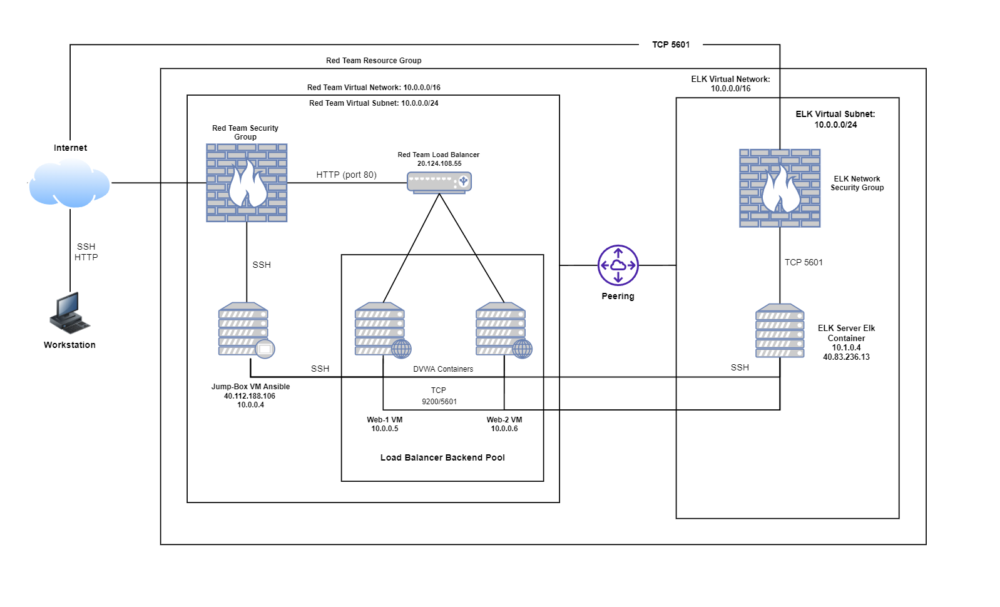
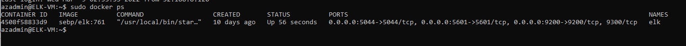
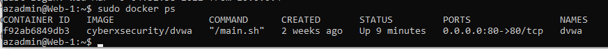
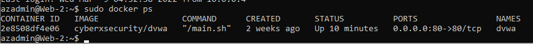
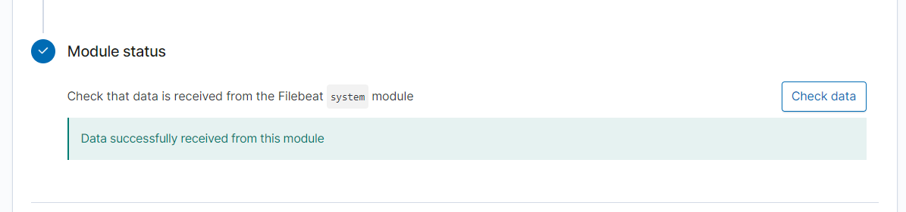
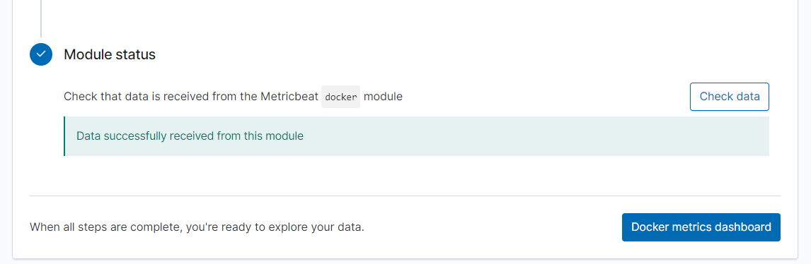

## Automated ELK Stack Deployment

The files in this repository were used to configure the network depicted below.

These files have been tested and used to generate a live ELK deployment on Azure. They can be used to either recreate the entire deployment pictured above. Alternatively, select portions of the yaml and config file may be used to install only certain pieces of it, such as Filebeat.

  - [Docker Setup](Ansible/Docker/ansible_playbooks.yml)
  - [ELK Configuration](Ansible/ELK/ansible.cfg)
  - [ELK Setup](Ansible/ELK/elk_playbook.yml)
  - [Hosts](Ansible/ELK/hosts)
  - [Filebeat Configuration](Ansible/Filebeat/filebeat-config.yml)
  - [Filebeat Playbook](Ansible/Filebeat/filebeat-playbook.yml)
  - [Metricbeat Configuration](Ansible/Metricbeat/metricbeat-config.yml)
  - [Metricbeat Playbook](Ansible/Metricbeat/metricbeat-playbook.yml)

This document contains the following details:
- Description of the Topologu
- Access Policies
- ELK Configuration
  - Beats in Use
  - Machines Being Monitored
- How to Use the Ansible Build

### Description of the Topology

The main purpose of this network is to expose a load-balanced and monitored instance of DVWA, the D*mn Vulnerable Web Application.

Load balancing ensures that the application will be highly effective, in addition to restricting access to the network. Load balancers provide the off-loading function to help defend against distributed denial-of-service (DDoS) attacks. The advantage of a jump box is to provide a single point of access into an infrastructure as well as keeping the VMs from being exposed by a public IP address. The jump box also provides control over your virtual machines providing access to log monitoring, access restriction, etc. 

Integrating an ELK server allows users to easily monitor the vulnerable VMs for changes to the network and system logs. Filebeat monitors the log files or locations that you specify, collects log events, and forwards them either to Elasticsearch or Logstash for indexing. Metricbeat takes the metrics and statistics that it collects and sends them to the output that the user specifies. 

The configuration details of each machine may be found below.

| Name     | Function | IP Address | Operating System |
|----------|----------|------------|------------------|
| Elk      | Server   | 10.1.0.4   | Linux/Ubuntu     |
| Jump Box | Gateway  | 10.0.0.4   | Linux/Ubuntu     |
| Web-1    | DVWA     | 10.0.0.5   | Linux/Ubuntu     |
| Web-2    | DVWA     | 10.0.0.6   | Linux/Ubuntu     |

### Access Policies

The machines on the internal network are not exposed to the public Internet. 

Only the Jump Box machine can accept connections from the Internet. Access to this machine is only allowed from my home IP address.

Machines within the network can only be accessed by my workstation and the jumpbox. The Jump Box machine was given access to the ELK VM and it's IP address is 10.0.0.4.

A summary of the access policies in place can be found in the table below.
| Name     | Publicly Accessible | Allowed IP Address  |
|----------|---------------------|---------------------|
| Elk      | No                  | [My Public IPV4 IP] |
| Jump Box | Yes                 | 52.188.8.120        |
| Web-1    | No                  | 10.1.0.4            |
| Web-2    | No                  | 10.1.0.4            |

### Elk Configuration

Ansible was used to automate configuration of the ELK machine. No configuration was performed manually, which is advantageous because it saves time and removes the chance of human error.

The playbook implements the following tasks:
- Installed Docker.io
- Installed pip3
- Installed Docker Python Module
- Increased Virtual Memory

The following screenshot displays the result of running `docker ps` after successfully configuring the ELK instance.

ELK:

Web-1:

Web-2:

### Target Machines & Beats
This ELK server is configured to monitor the following machines:
- Web-1: 10.0.0.5
- Web-2: 10.0.0.6

We have installed the following Beats on these machines:
- Filebeat:

- Metricbeat:

These Beats allow us to collect the following information from each machine:
- _TODO: In 1-2 sentences, explain what kind of data each beat collects, and provide 1 example of what you expect to see. E.g., `Winlogbeat` collects Windows logs, which we use to track user logon events, etc._

### Using the Playbook
In order to use the playbook, you will need to have an Ansible control node already configured. Assuming you have such a control node provisioned: 

SSH into the control node and follow the steps below:
- Copy the _____ file to _____.
- Update the _____ file to include...
- Run the playbook, and navigate to ____ to check that the installation worked as expected.

_TODO: Answer the following questions to fill in the blanks:_
- _Which file is the playbook? Where do you copy it?_
- _Which file do you update to make Ansible run the playbook on a specific machine? How do I specify which machine to install the ELK server on versus which to install Filebeat on?_
- _Which URL do you navigate to in order to check that the ELK server is running?

_As a **Bonus**, provide the specific commands the user will need to run to download the playbook, update the files, etc._
